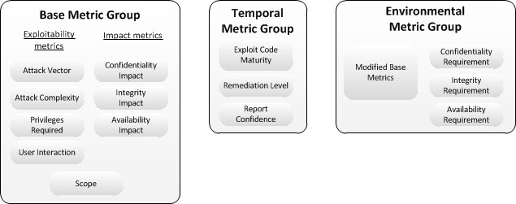

https://ixyzero.com/blog/archives/3368.html

https://cve.mitre.org/

https://www.first.org/cvss/specification-document

CVE: Common Vulnerabilities and Exposures
CVSS: Common Vulnerability Scoring System

CVSS的度量指标
CVSS由三个度量组：「基础-Base」，「时间-Temporal」和「环境-Environmental」组成

基础度量组反映了一个漏洞的固有特征——它不随着时间和用户环境的变化而变化。它由两组指标组成：可利用指标和影响指标。

