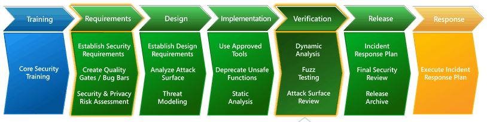

```
OSSTMM: Open Source Security Testing Methodology Manual
盲测（blind）
双盲测试（double blind）
灰盒测试 （gray box）
双灰盒测试（double gray box）
串联测试 （tandem）
反向测试 （reversal）

信息系统安全评估框架（ISSAF）
INFORMATION SYSTEMS SECURITY ASSESSMENT FRAMEWOR

owasp


 Web应用安全联合威胁分类 (Web Application Security Consortium Threat Classification,WASC-TC
 
 枚举视图（Enumeration View）
 开发视图 （Development View）
 分类交叉引用视图 （Taxonomy  Cross Reference  View）
 
 分类交叉引用视图 （Taxonomy  Cross Reference  View）：建立了一个包含多种Web应用安全标准的交叉引用视图，通过对该视图的引用，能够帮助审计人员和开发者将当前所使用的标准中的术语映射到其他标准中。
 
 WASC-TC标准提供了三个不同的视图，分别是枚举视图、开发视图和交叉引用视图。枚举视图起到了一个基础数据库的作用，它包含了所有在Web应用中发现的攻击方法和薄弱环节。开发视图将这些攻击方法和薄弱环节组合成一系列漏洞，并根据它们发生在开发过程中的哪个阶段对其进行分类。这些开发阶段可以是设计阶段、实现阶段和部署阶段。交叉引用视图用于在WASC-TC标准中引用其他的应用安全标准。
 
 PTES:Penetration Testing Execution Standard
 情报收集阶段
 威胁建模阶段
 漏洞分析阶段
 渗透攻击阶段
 后渗透攻击阶段
 报告阶段
  
  whois 
  host
  dig
  dnsenum
  dnsdict6
  fierce
  dmitry
  
  maltego
  
  tcptraceroute
  tctrace
  theharvester
  metagoofil
  
  ping/arping/hping/fping/nping
  alive6
  detect-new-ip6
  passive_discovery6
  nbtscan 10.1.11.1-251
  p0f
  nmap/zenmap
  unicornscan
  amap
  onesixtyone
  snmpcheck 
  ike-scan
  
  
  openvas
  cisco auditing tool
  cisco global exploiter
  bed
  jbrofuzz
  samrdump
  snmpwalk
  dbpwaudit
  sqlmap
  sqlninja
  burpsuite
  nikto
  paros
  w3af
  webscarab
  
  https://github.com/trustedsec/social-engineer-toolkit
  msfconsole
  hash-identifier
  hashcat
  rainbowcrack
  samdump2
  john ripper
  johnny
  ophcrack
  crunch
  cewl
  hydra
  medusa
  dnschef
  arpspoof
  ettercap
  dsniff
  
  cymothoa
  
  intersect
  dns2tcp
  iodine
  ncat
  proxychains
  ptunnel
  socat
  sslh
  stunnel4
  
  webacoo
  weevely
  
  watch ss -stplu	
  通过套接字实时观察 TCP, UDP 端口。
  
  tcpkill -9 host google.com	
  阻止从主机访问 google.com
  
  getent passwd	
  列出 Linux 上的用户。
  
  echo "user:passwd" | chpasswd	
  用一行命令重置密码。
  
  rpm -q --changelog openvpn	
  检查已安装的 RPM 是否针对 CVE 打了补丁，可以用 grep 命令过滤出跟 CVE 有关的输出。
  
  
  upx -9 -o output.exe input.exe	
  在 Linux 上使用 UPX 压缩 .exe 文件。
  
  zcat archive.gz	
  在 Linux 以不解压缩的方式读取一个 gz 文件。
  
  zless archive.gz	
  用较少的命令实现对 .gz 压缩包相同的功能。

  zgrep 'blah' /var/log/maillog*.gz	
  在 Linux 上对 .gz 压缩包里面的内容执行搜索，比如搜索被压缩过的日志文件。

  vim file.txt.gz	
  使用 vim 读取 .txt.gz 文件（我个人的最爱）。


find and fix
defend and defer
secure at the source

SDL: security development lifecycle
* 安全培训(training)：推广安全编程意识
* 需求分析(requirements)： 寻找安全嵌入的最优方式
* 系统设计(design): 威胁建模设计
* 实现(implementation)： 安全开发
* 验证(verification)： 黑/白盒测试
* 发布(release)： 最后检查确认
* 响应(response)：应急响应，bug跟踪解决


信息安全:
机密性
完整性
可用性

风险分析:
资产等级划分
威胁分析
风险分析
确认解决方案

风险分类:
spoofing 
tampering
repudiation
informationDisclosure
denial of service
elevation of privilege

DREAD:
Damage Ptential
Reproducibility
Exploitability
Affected Users
Discoverability

好的安全方案:
能够有效解决问题
用户体验好
高性能
低耦合
易于扩展与升级

secure by DEFAULT
1. 白名单
2. 最小权限

纵深防御
1. 多层面，多方面防护
2. 正确的地方做正确的事情

UTM
unified threat management

数据与代码分离

不可预测性

@import url("http://1.com/1.html");

chrome
浏览器进程
渲染进程
插件进程
扩展进程

奔溃时只奔溃了一个tab，单进程会奔溃整个浏览器

iframe sanbox 标签

CRLF：
\n \r 

x.php.[\0].jpg
0x00 为中止符

RBAC:
Role-Based Access control

密码系统的安全性应该依赖密钥的复杂性，而不是算法的保密性

CC(Challenge Collapsar)
CAPTCHA Completely Automated Public Turing Test to Tell Computers and Humans Apart (全自动区分计算机和人类的图灵测试)


资源耗尽攻击


ReDOS


  ```
  
  
  
  
  
  
   
 
 
